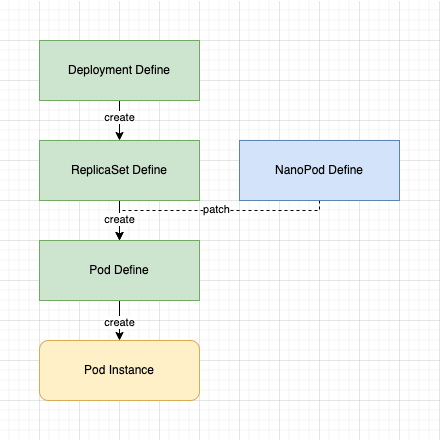

# NanoPod

NanoPod help you to patch your pods automatically without changing your Deployment/StatefulSet/Job/ReplicaSet etc.

## Description

The NanoPods for pods is like the nano-armor for the Iron-Man, It can automatically arm your pods without changing Deployment/StatefulSet/Job/ReplicaSet etc. Only the pods labeled with "nano-pods" would be accessed to. It provides an aspect oriented configuration.

## How To Work

The following picture shows how does Nano Pod work.



## Getting Started

NanoPod Operator required [cert-manager](https://cert-manager.io/docs/installation/), so firstly make sure you have [cert-manager](https://cert-manager.io/docs/installation/) installed

Then run the following scripts in your Kubernetes, to install NanoPod Operator and related CRDs, register webhooks.
```shell
kubectl apply -f https://github.com/Duncan-tree-zhou/nano-pod/releases/download/v0.0.1/nano-pod-operator.yaml
```

After the `nano-pod-controller-manager` deployment is ready, the functionality of NanoPod is enabled. 

Then create namespace `nano-pod-test` for testing, and apply the following yaml to `nano-pod-test` namespace: 

```yaml
# my-nano-pod.yaml
apiVersion: nanopod.nanopod.treezh.cn/v1
kind: NanoPod
metadata:
  name: my-nano-pod
  namespace: nano-pod-test
spec:
  template:
    spec:
      containers:
        - name: mysql
          env:
            - name: MYSQL_ALLOW_EMPTY_PASSWORD
              value: "true"
            - name: MYSQL_DATABASE
              value: mydb02
          resources:
            limits:
              cpu: 500m
              memory: 512Mi
            requests:
              cpu: 100m
              memory: 256Mi

```

The structure of spec.template is exactly the same as of deployment.spec.template.

Make sure the NanoPod had been created.

```shell
kubectl get nanopod -n nano-pod-test

NAME          AGE
my-nano-pod   12s
```

Since then, the pods created with label `nano-pods: "my-nano-pod"` would be automatically patched by NanoPod `my-nano-pod`.

If you apply a Deployment like this:

```yaml
# mysql.yaml
apiVersion: apps/v1
kind: Deployment
metadata:
  name: mysql
  namespace: nano-pod-test
  labels:
    app: mysql
spec:
  replicas: 1
  selector:
    matchLabels:
      app:  mysql
  template:
    metadata:
      labels:
        app:  mysql
        nano-pods: "my-nano-pod"
    spec:
      containers:
        - name: mysql
          image: treezh-docker.pkg.coding.net/demo03/public/mysql:8.0.31
          env:
            - name: MYSQL_DATABASE
              value: mydb01

```

Run the following script to get the pod.
 
```shell
kubectl get pod -l app=mysql -o yaml
```

you will get a pod with NanoPod patched.

```yaml
# pod.yaml
apiVersion: v1
kind: Pod
metadata:
  name: mysql-869c5bd95b-bkd4p
  namespace: nano-pod-test
spec:
  containers:
    - name: mysql
      image: treezh-docker.pkg.coding.net/demo03/public/mysql:8.0.31
      env:
        - name: MYSQL_ALLOW_EMPTY_PASSWORD # this env is added by NanoPod
          value: "true"
        - name: MYSQL_DATABASE
          value: mydb02 # this value is overwritten by NanoPod
      resources: # resources are added by NanoPod
        limits:
          cpu: 500m
          memory: 512Mi
        requests:
          cpu: 100m
          memory: 256Mi
```

Then you can see env `env0101` and resources are added, the value of env `env0102` is overwritten from `value0102` to `value0103`.

## Contributing

 If you have any problem, welcome to create issue or PR to this repo ,or contact me by email `duncan.tree.zhou@gmail.com`.

## License

[Apache 2.0 License](./LICENSE).

